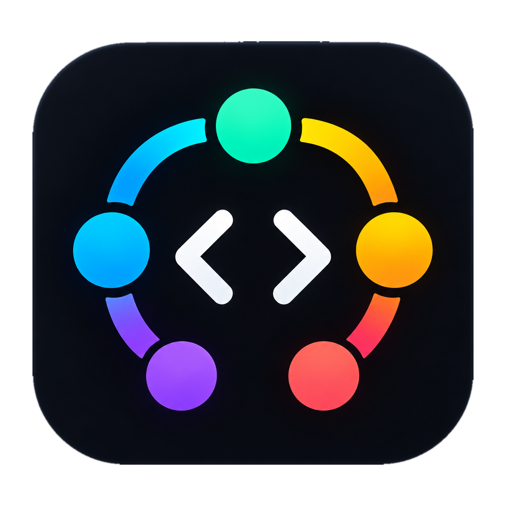
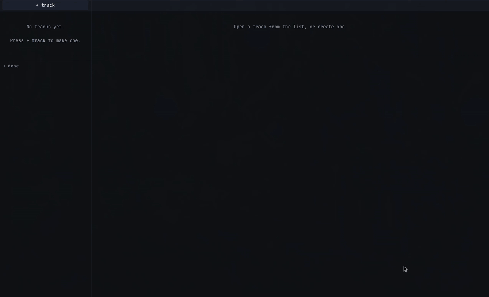

<p align="center">
  
</p>

<h1 align="center">oh-my-ide</h1>

<p align="center">
  <strong>Run ten Claude Code sessions at once. Never lose one. Always know whose move it is.</strong>
</p>

<p align="center">
  A local-first cockpit for engineers who live in the terminal and have too many of them open.
</p>

<p align="center">
  <a href="docs/media/demo.mp4">
    
  </a>
  <br>
  <sub>1.5× speed. <a href="docs/media/demo.mp4">Watch the full-quality MP4</a>.</sub>
</p>

---

## Does this sound familiar?

- You have **twelve terminal tabs** of Claude sessions open, and you can't remember which one was
  the security review.
- A terminal closed, or the laptop rebooted, and **the session went with it**.
- Someone asked you something in Slack. You told Claude to investigate. Twenty minutes later
  the answer is ready, and you've **lost the Slack thread, the PR and the reason you asked**.
- It's 9am and you **don't know where to start**, because nothing tells you which of your 40
  open loops is waiting on you and which is waiting on the machine.

oh-my-ide solves this with one idea: the **Track**.

## The Track

A Track is an open loop, meaning something you owe someone (or yourself). It keeps
everything about that loop in one place:

| | |
|---|---|
| **Question** | What the track is trying to answer. You can answer a question; a label just goes stale. |
| **Sessions** | One or more live Claude Code sessions, rendered right in the track. You can type into them. |
| **Refs** | Paste a PR, issue, Slack permalink, Jira URL or bare `PAY-123`. It becomes a typed link. |
| **Notes & timeline** | The track's history, so coming back means reading it instead of piecing it together. |
| **Court** | Whose move it is: `ON ME`, `ON CLAUDE`, `ON THEM`, `PARKED`. It's worked out for you. You can pin it, but you never have to maintain it. |

Court is the important one. **Todo/doing/done can't tell you where to start. Court can.**
When a session is thinking, the track is `ON CLAUDE`. When it's waiting on you, the track
flips to `ON ME` and the sidebar tells you *1 needs you*. Click the chip to see which rule
fired.

## Why you can trust it with your sessions

**Closing the app never costs you a session.** This comes from how the app is built, not
from a promise:

```
Electron  ──unix socket──▶  omid daemon  ──documented CLI──▶  Claude supervisor
(disposable)                (restartable)                     (owns the sessions)
```

- **Electron owns nothing durable.** Kill it, crash it, close it. Nothing is lost.
- **The daemon (`omid`)** owns the socket, the SQLite database and the pollers, but it does
  **not** own the sessions. You can restart it at any time.
- **Claude Code's own background supervisor** owns the sessions. The cockpit attaches to
  them and doesn't hold them hostage.

So `claude attach <id>` in a plain terminal works **at the same time** as the cockpit. If
you stop using oh-my-ide tomorrow, every session is still there in `claude agents`.
Nothing is locked in.

## What else is in it

- 🏠 **Local-first.** No server, no account, no telemetry, no sync. One SQLite file on your disk.
- 🔌 **Works offline.** Ref parsing is plain regex, so it needs no API tokens and no OAuth.
- ⌨️ **Terminal-native.** It runs the real Claude Code TUI, not a chat window pretending to be one.
- 🗂️ **Tabs that survive restarts.** Reopen the app and your open tracks are where you left them.
- 🧱 **Contained coupling.** One package, `packages/claude-adapter`, is allowed to know that
  `~/.claude` exists. It checks the Claude Code version and degrades gracefully instead of breaking.
- 🚫 **No Sessions screen, on purpose.** Claude Code already has `claude agents`. In oh-my-ide
  a session belongs to a track; it isn't a place you go to.

## Quick start

Requires **Node 22+**, **pnpm**, and **Claude Code 2.1+** on `PATH`.

```sh
git clone git@github.com:codegik/oh-my-ide.git && cd oh-my-ide
pnpm install
./start.sh            # fetches the electron binary on first run, builds, opens the app
```

The daemon keeps running after you close the window. That's deliberate: it's why closing
the app never costs you a session.

| command | what it does |
|---|---|
| `./start.sh`         | build if needed, then open the app |
| `./start.sh doctor`  | check prerequisites (node, pnpm, claude, electron, socket) |
| `./start.sh status`  | is the daemon up, and what sessions exist |
| `./start.sh build`   | force a rebuild |
| `./start.sh daemon`  | run the daemon in the foreground with logs |
| `./start.sh stop`    | stop the daemon (**Claude sessions keep running**) |
| `./start.sh install` | add oh-my-ide to the app launcher (walker, etc.) with its icon |

## Status

Early. Here's where things stand:

**Works today**
- Create tracks from a folder, attach new or existing Claude sessions, several per track
- Live, typeable Claude Code TUI inside each track
- Typed refs: GitHub PR/issue, Slack permalink, Jira URL, bare `PAY-123`
- Court worked out from session state, with a "why?" popover to pin, drop or close
- Tracks and open tabs saved in SQLite, surviving restarts

**Not built yet**
- GitHub poller (PR refs don't show live state yet)
- Auto-joining sessions to tracks by branch
- Triage inbox
- Slack / Jira / Calendar integrations

The full design is in [`docs/PLAN.md`](docs/PLAN.md). The decisions settled by measurement
are in [`docs/decisions/`](docs/decisions/).

## Development

```sh
pnpm install
pnpm test                  # unit + contract tests
OMI_LIVE=1 pnpm vitest run # also run contract tests against the installed CLI
pnpm typecheck
```
